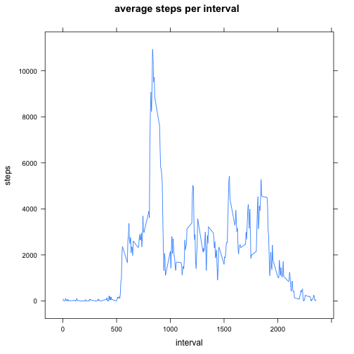

Activity data loading using `read.csv`

```r
library(lattice)

activity <- read.csv("activity.csv", header = T)
activity$date <- as.Date(activity$date)
activity$interval <- as.integer(activity$interval)
```

What is mean total number of steps taken per day?

```r
totals <- aggregate(steps ~ date, activity, sum, na.rm=T)
histogram(~steps, totals)
```

 

```r
summary(totals)
```

```
##       date                steps      
##  Min.   :2012-10-02   Min.   :   41  
##  1st Qu.:2012-10-16   1st Qu.: 8841  
##  Median :2012-10-29   Median :10765  
##  Mean   :2012-10-30   Mean   :10766  
##  3rd Qu.:2012-11-16   3rd Qu.:13294  
##  Max.   :2012-11-29   Max.   :21194
```

What is the average daily activity pattern?

```r
totals.interval <- aggregate(steps ~ interval, activity, sum, na.rm=T)
xyplot(steps ~ interval, data=totals.interval, main = "average steps per interval", ylab = "steps", xlab = "interval", type ="l")
```

 

```r
max_interval <- totals.interval$interval[which(totals.interval$steps == max(totals.interval$steps))]
print(paste0("Interval with max number of steps accross all days is ", max_interval))
```

```
## [1] "Interval with max number of steps accross all days is 835"
```

Histogram after imputing NAs by filling in average value for steps on the entire dataset


```r
print(paste0("Number of rows with mising NAs is ", sum(!complete.cases(activity))))
```

```
## [1] "Number of rows with mising NAs is 2304"
```

```r
activity.full <- activity[,]
activity.full[!complete.cases(activity.full),'steps'] <- mean(activity$steps, na.rm=T)
totals <- aggregate(steps ~ date, activity.full, sum)
histogram(~steps, totals)
```

 

```r
summary(totals)
```

```
##       date                steps      
##  Min.   :2012-10-01   Min.   :   41  
##  1st Qu.:2012-10-16   1st Qu.: 9819  
##  Median :2012-10-31   Median :10766  
##  Mean   :2012-10-31   Mean   :10766  
##  3rd Qu.:2012-11-15   3rd Qu.:12811  
##  Max.   :2012-11-30   Max.   :21194
```

Using imputed NAs with mean of steps shows minor changes to the mean compared the the original value, while the median stayed the same.

Are there differences in activity patterns between weekdays and weekends?


```r
activity.type <- cbind(activity.full, type=as.factor(
  ifelse(weekdays(activity.full$date) == "Saterday" 
         | weekdays(activity.full$date) == "Sunday", "weekend", "weekday")))

totals <- aggregate(steps ~ interval + type, activity.type, mean)

xyplot(steps ~ interval | type, type = "l", layout = c(1, 2),
    main = "Average Number of Steps by Time Interval", data=totals,
    xlab = "Time Interval (5-mins)", ylab = "Average number of steps")
```

 
